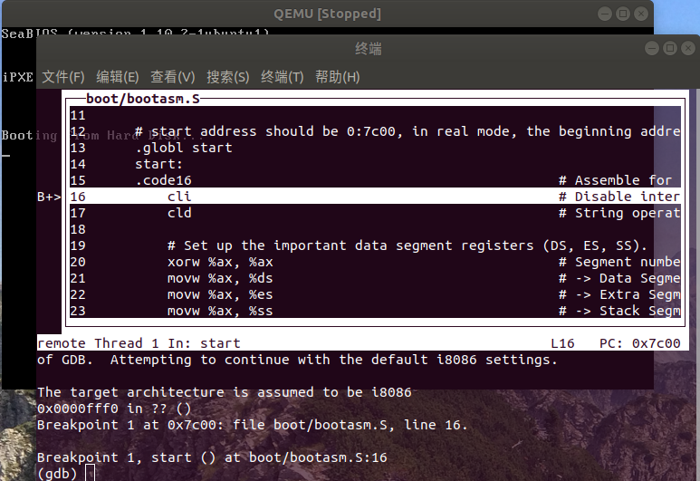

>从CPU加电后执行的第一条指令开始，单步跟踪BIOS的执行。
修改tools/gdbinit的内容如下：
```
set architecture i8086
target remote :1234
```
然后make clean一下，执行make debug。(这段makefile代码没看，根据百度学的)。

顺利运行后,会出现这个，这时候执行指令位于0x0000fff0处（BIOS第一条指令）：
```
on
of GDB.  Attempting to continue with the default i8086 settings.

The target architecture is assumed to be i8086
warning: No executable has been specified and target does not support
determining executable automatically.  Try using the "file" command.
0x0000fff0 in ?? ()
(gdb) 
```
打印出cs和eip的值：
```
(gdb) p/x $cs
$1 = 0xf000
(gdb) p/x $eip
$2 = 0xfff0
```
我们查一下当前位置的指令：
```
(gdb) x /i 0xffff0
   0xffff0:     ljmp   $0x3630,$0xf000e05b          //这里我的第一个参数是0x3630，不知道为什么，大佬说是qemu版本问题QAQ

```
可以看出来，当前位于0xffff0处，要执行一条跳转指令。
我们si一下，就会进入这个地址。

>在初始化位置0x7c00设置实地址断点,测试断点正常。
配置gdb文件
```
file obj/bootblock.o
set architecture i8086
target remote :1234
b *0x7c00
continue
```
执行make clean和make debug之后得到：

我们看到上面正好显示的正好是boot/bootasm.S中的入口代码。

这时候我们打印一下cs和eip的值：
```
(gdb) p/x $cs
$1 = 0x0
(gdb) p/x $eip
$2 = 0x7c00
```

>从0x7c00开始跟踪代码运行,将单步跟踪反汇编得到的代码与bootasm.S和 bootblock.asm进行比较。
make debug后执行x /10i $pc指令得到：
```
=> 0x7c00 <start>:      cli
   0x7c01 <start+1>:    cld
   0x7c02 <start+2>:    xor    %eax,%eax
   0x7c04 <start+4>:    mov    %eax,%ds
   0x7c06 <start+6>:    mov    %eax,%es
   0x7c08 <start+8>:    mov    %eax,%ss
   0x7c0a <seta20.1>:   in     $0x64,%al
   0x7c0c <seta20.1+2>: test   $0x2,%al
   0x7c0e <seta20.1+4>: jne    0x7c0a <seta20.1>
   0x7c10 <seta20.1+6>: mov    $0xd1,%al
```

源码为：（去掉注释）
```
    xorw %ax, %ax                                   # Segment number zero
    movw %ax, %ds                                   # -> Data Segment
    movw %ax, %es                                   # -> Extra Segment
    movw %ax, %ss                                   # -> Stack Segment
seta20.1:
    inb $0x64, %al                                  # Wait for not busy(8042 input buffer empty).
    testb $0x2, %al
    jnz seta20.1
    movb $0xd1, %al                                 # 0xd1 -> port 0x64
```
可以看出来，虽然略有差异，不过执行效果是一致的。
>自己找一个bootloader或内核中的代码位置，设置断点并进行测试。

自行发挥^_^
